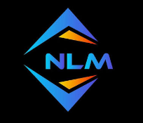

<div align="center">

  

  # NANDLAL AHIRWAR
  ### Village Construction & Rural Development
  **"Building Better Villages, One Project at a Time."**

  <p align="center">
    <a href="https://react.dev/"></a>
    <a href="https://vitejs.dev/"></a>
    <a href="https://www.typescriptlang.org/"></a>
    <a href="https://tailwindcss.com/"></a>
    <a href="https://www.framer.com/motion/"></a>
    <a href="https://wa.me/917489070701"></a>
  </p>

  <p align="center">
    A premium, modern, highly visual web platform for rural Indian construction, blending <strong>Modern Architecture Studio aesthetics</strong>, <strong>3D Architectural Staging</strong>, <strong>Ground-Level Masonry Craftsmanship</strong>, and <strong>Mobile-First WhatsApp Integrations</strong>.
  </p>

  <p align="center">
    <a href="#-key-features">Key Features</a> •
    <a href="#-tech-stack">Tech Stack</a> •
    <a href="#-scope-of-services">Services</a> •
    <a href="#-getting-started">Getting Started</a> •
    <a href="#-project-structure">Project Structure</a> •
    <a href="#-contact">Contact</a>
  </p>

</div>

---

## 🏛️ About the Platform

**Nandlal Ahirwar** is a trusted rural construction contractor committed to developing stronger, climate-resilient village communities through:

* 🏫 **School Buildings** — Well-ventilated classrooms with shaded verandahs built for learning.
* 🏡 **Residential Homes** — Pukka family residences with courtyard-oriented layouts.
* 🏛️ **Community Buildings** — Open colonnade Panchayat halls with decorative brick jaali work.
* 🛣️ **Village Infrastructure** — Cement concrete (CC) approach roads and drainage networks.
* 🔨 **Renovation & Restoration** — Strengthening heritage structures and structural additions.
* 🏗️ **Custom Construction** — Agricultural storage godowns, sheds, and commercial retail blocks.

---

##  Key Features

- **📐 3D Architectural Transformation Hero**
  Interactive Blueprint $\rightarrow$ Structure $\rightarrow$ Completed Building staging with architectural coordinates, measurement indicators, and floating value cards.
- **🗺️ Interactive Village Impact Map**
  Clickable panorama landscape with pulsing hotspot markers for Schools, Community Centers, Homes, and Roads.
- **📊 Interactive Quick Project Estimator**
  Dynamic built-up area slider, finish grade selector (*Durable Pukka vs. Architectural Finish*), timeline estimation, and direct WhatsApp quote enquiry.
- **📝 Zod-Validated Consultation Form**
  Type-safe form with error validation and a 1-click WhatsApp forward featuring pre-filled client requirements.
- **🖼️ Masonry Gallery & Case Studies**
  Filterable project archive with full-screen **Lightbox Modal** (with keyboard navigation) and dedicated editorial case study detail pages (`/projects/:id`).
- **📱 Mobile-First Quick Action Bar**
  Fixed sticky bottom bar on mobile viewports providing one-tap **WhatsApp**, **Direct Call**, and **Quick Quote** buttons.
- **✨ Smooth Kinetic Scrolling**
  Powered by Lenis smooth scrolling engine and GPU-accelerated Framer Motion transitions.

---

##  Tech Stack

| Layer | Technology |
| :--- | :--- |
| **Frontend Framework** | [React 18](https://react.dev/) + [TypeScript](https://www.typescriptlang.org/) |
| **Build Tool** | [Vite](https://vitejs.dev/) |
| **Styling & Design System** | [Tailwind CSS](https://tailwindcss.com/) (Earthy Terracotta & Charcoal palette) |
| **Smooth Scrolling** | [Lenis](https://github.com/darkroomengineering/lenis) |
| **Animations** | [Framer Motion](https://www.framer.com/motion/) |
| **Routing** | [React Router v6](https://reactrouter.com/) |
| **Form Management** | [React Hook Form](https://react-hook-form.com/) + [Zod](https://zod.dev/) |
| **Icons** | [Lucide React](https://lucide.dev/) |

---

## 📂 Project Structure

```bash
d:\NLL\
├── public/
│   ├── favicon.svg                  # NLM Scalable Vector Favicon
│   ├── favicon.png                  # NLM PNG Favicon
│   ├── logo.png                     # NLM Official Logo
│   ├── logo.svg                     # Vector NLM Monogram
│   └── images/
│       ├── nandlal-ahirwar.jpg      # Official Contractor Portrait
│       ├── hero/                    # Hero School & Blueprint Visuals
│       ├── services/                # Specialized Service Photography
│       ├── projects/                # Portfolio Case Study Imagery
│       └── architecture/            # Brick Masonry & Craftsmanship Details
├── src/
│   ├── components/
│   │   ├── forms/                   # ConsultationForm & QuickQuoteCalculator
│   │   ├── layout/                  # Navbar, Footer, MobileBottomBar, FloatingWhatsApp
│   │   ├── sections/                # Hero, TrustStrip, AboutPreview, Services, Gallery...
│   │   └── ui/                      # Button, SectionHeading, BlueprintGrid, LightboxModal
│   ├── data/
│   │   ├── projects.ts              # Data-driven project case studies & specs
│   │   ├── services.ts              # 6 Core construction services definition
│   │   ├── testimonials.ts          # Community feedback & reviews
│   │   ├── timeline.ts              # 5-Stage construction workflow
│   │   └── whyChooseUs.ts           # Core credibility pillars
│   ├── lib/
│   │   ├── utils.ts                 # Tailwind merge utilities
│   │   └── whatsapp.ts              # Dynamic WhatsApp pre-filled link builder
│   ├── pages/
│   │   ├── Home.tsx                 # Full 14-section signature homepage
│   │   ├── About.tsx                # Contractor story, values, and photo profile
│   │   ├── Services.tsx             # Detailed service specifications & scope
│   │   ├── Projects.tsx             # Complete project portfolio & search
│   │   ├── ProjectDetails.tsx       # In-depth editorial case study page
│   │   ├── WhyChooseUs.tsx          # Trust pillars & process timeline
│   │   └── Contact.tsx              # Consultation form & estimator
│   ├── App.tsx                      # Router & Lenis smooth scroll setup
│   └── main.tsx                     # React root entry
├── .env                             # Configurable contractor credentials
├── tailwind.config.js               # Tailored Earth & Terracotta theme tokens
└── vite.config.ts                   # Vite configuration
```

---

##  Getting Started

### Prerequisites

- [Node.js](https://nodejs.org/) (version 18+ recommended)
- [npm](https://www.npmjs.com/) or [yarn](https://yarnpkg.com/)

### 1. Clone the repository
```bash
git clone https://github.com/mukeshahirwar9644/NL.git
cd NL
```

### 2. Install dependencies
```bash
npm install
```

### 3. Configure Environment Variables
Create or inspect the `.env` file in the project root:
```env
VITE_CONTRACTOR_NAME="Nandlal Ahirwar"
VITE_CONTRACTOR_TAGLINE="Building Better Villages, One Project at a Time."
VITE_WHATSAPP_NUMBER="+917489070701"
VITE_PHONE_NUMBER="+917489070701"
VITE_EMAIL_ADDRESS="nandlalahirwar9644@gmail.com"
VITE_OFFICE_LOCATION="Village Sukha (Bharatpur) 482003"
```

### 4. Start Development Server
```bash
npm run dev
```
Open **`http://localhost:5173/`** in your browser.

### 5. Build for Production
```bash
npm run build
```

---

## 📞 Direct Contact

* **Lead Contractor:** Nandlal Ahirwar
* **WhatsApp / Phone:** [+91 7489070701](https://wa.me/917489070701)
* **Email:** [nandlalahirwar9644@gmail.com](mailto:nandlalahirwar9644@gmail.com)
* **Location:** Village Sukha (Bharatpur) 482003, Madhya Pradesh, India

---

<div align="center">
  <p>© 2026 Nandlal Ahirwar. Village Construction & Rural Development. All rights reserved.</p>
</div>
